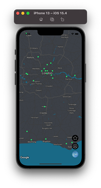
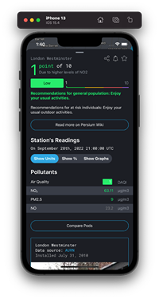
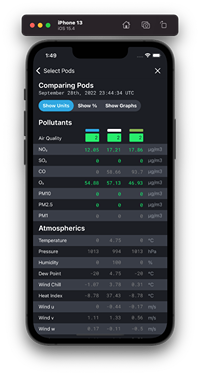
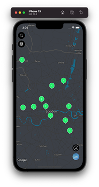
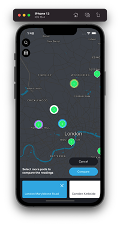
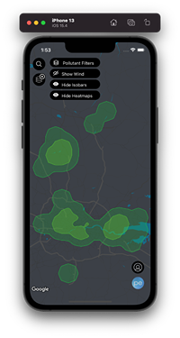
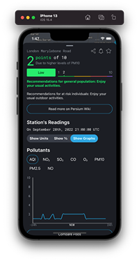
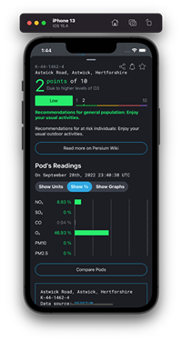
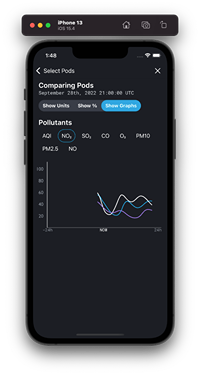
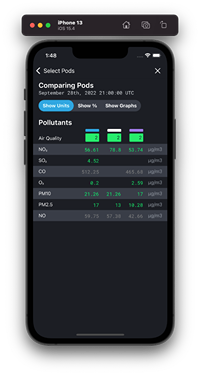

### PERSIUM

# MapView Mobile:   React Native Proof of Concept

This codebase is a proof of concept for Persium MapView. The MapView application lends itself well to being a native mobile application. The original frontend codebase is written with react and redux, which suggests that a mobile application could be quickly developed using react-native.

This project is bootstrapped with expo. To get it up and running:

- Clone the repo
- `npm install`
- `npm start`
- In the terminal, a QR code will be present. Use your iPhone or Android device to open the application. You will be prompted to download Expo Go as a means to view this application in development. You can also follow other options specified there if you are savvy with Android Studio or XCode.

## Why React Native?

The frontend codebase is written in react, with redux. The redux layer of the application (which emcompasses the model layer in an MVC scheme), can be copy-pasted from the front end almost verbatim. The fact that we can reuse almost all business logic saves hundreds of hours of development.

This is a huge advantage, in addition to the other general advantages of react native.

## Challenges

React-Native is an obvious choice for a mobile-native MapView application, but not a perfect choice. Here are a few of the primary challenges that this POC attempts to demonstrate are possible in RN:

### **The Map**

The front end codebase uses leaflet and react-leaflet to render its primary map component. In this POC, I used [react-native-maps](https://github.com/react-native-maps/react-native-maps), the most popular mapping tool for react-native. This has worked well using the google maps option, with a custom style for the base of google maps. However, it also requires a google API key. Alternatives would be to use [mapbox for react-native](https://github.com/rnmapbox/maps), though tests with that showed very poor interactivity and performance.

Certain features present on the front end may prove challenging to reproduce using react-native (or any native app):

- Isobars and heatmap bezier curves - in the frontend javascript code, I was able to create perfectly smooth beziers using SVGs. This may be more challenging in a native environment, and may require [turfjs's bezierSpline](https://turfjs.org/docs/#bezierSpline), which is an inferior solution
- Windmaps in the frontend code are easily created using [leaflet-velocity](https://github.com/onaci/leaflet-velocity). There is no such parallel for mobile, so a similar effect would have to be coded from scratch

### **The Graphs**

The frontend uses [HighchartsJS](https://www.highcharts.com/) for most of the graphing functionality. The graphs will need to be rewritten in a react-native friendly charting library. [Here's](https://blog.logrocket.com/the-top-8-react-native-chart-libraries-for-2021/) a short list.
